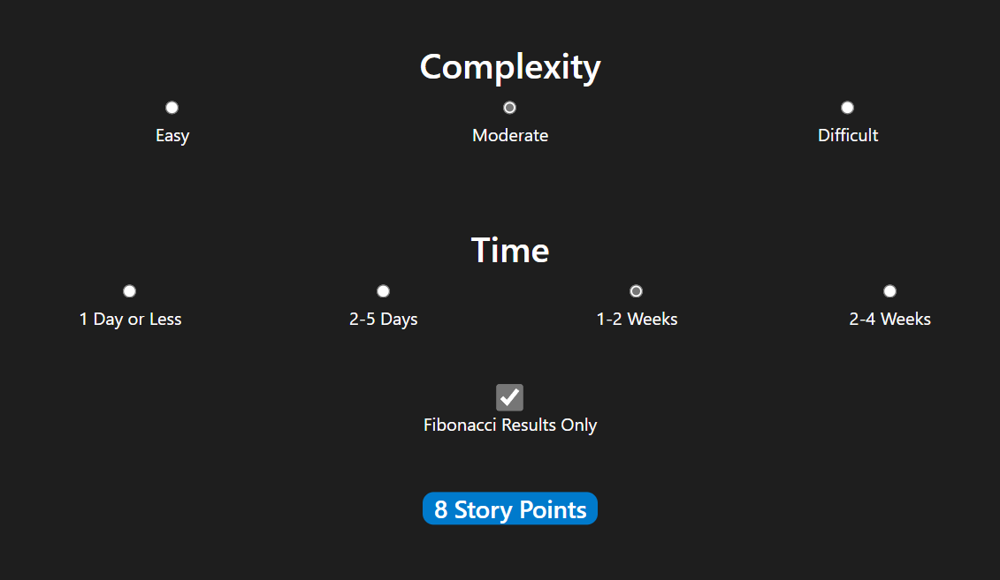

  
   
  Run in the browser at:
   
  <a href="https://nomadicgopher.github.io/Story_Point_Calculator/">  
    <b>nomadicGopher.GitHub.io/Story_Point_Calculator</b>
  </a>

---

### Support This Developer
* [**GitHub Sponsors**](https://github.com/sponsors/nomadicGopher)
* [**Ko-Fi**](https://ko-fi.com/nomadicGopher)

  
<b>Crypto Currencies</b>

  <ul>
    <li><b>ETH</b>: 0x7531d86D5Dbda398369ec43205F102e79B3c647A</li>
    <li><b>BTC</b>: bc1qtkuzp85vph7y37rqjlznuta293qsay07cgg90s</li>
    <li><b>LTC</b>: ltc1q9pquzquaj6peplygqdrcxxvcnd5fcud7x80lh8</li>
    <li><b>DOGE</b>: DNQ3GHBVEcNpzXNeB7B4sPqd7L1GhUpMg3</li>
    <li><b>SOL</b>: EQ6QwibvKZsazjvQGJk6fsGW4BQSDS1Zs6Dj79HfVvME</li>
  </ul>

